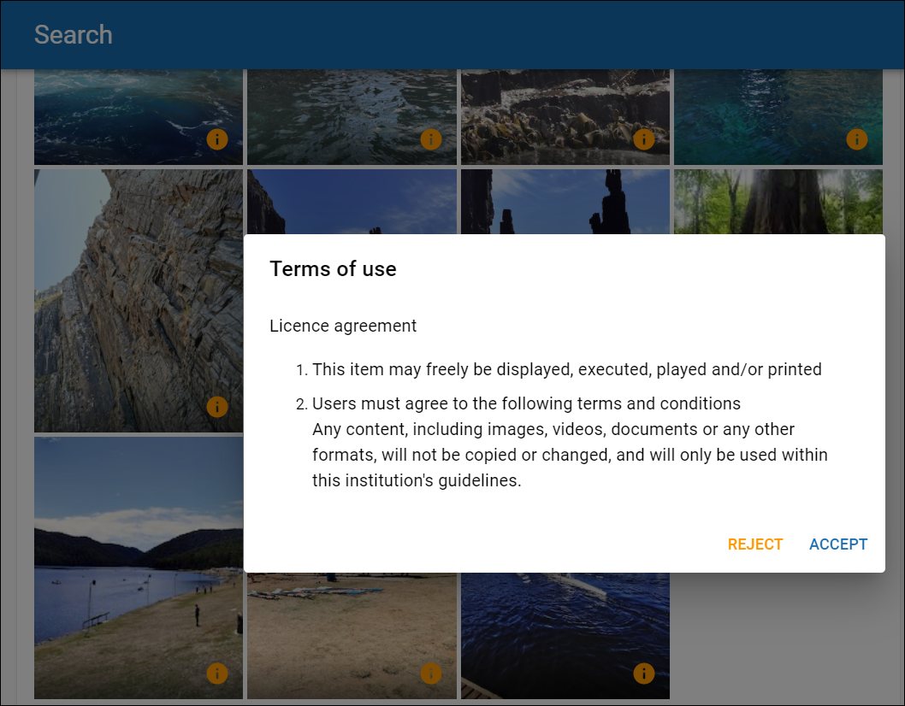
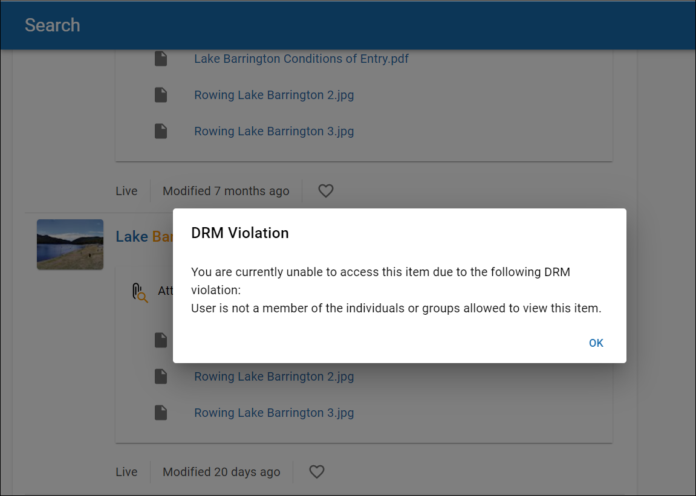
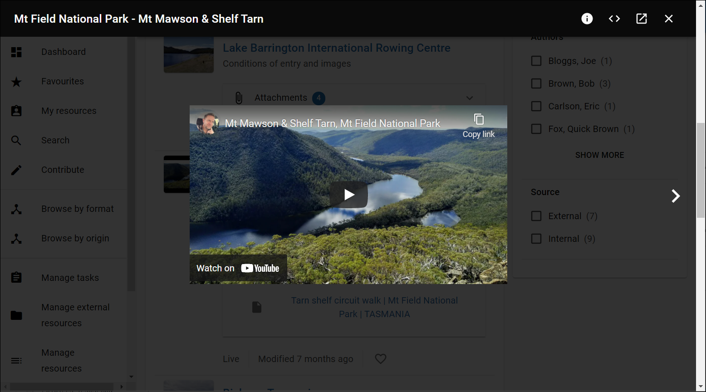
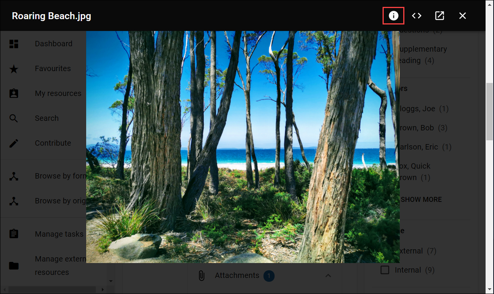
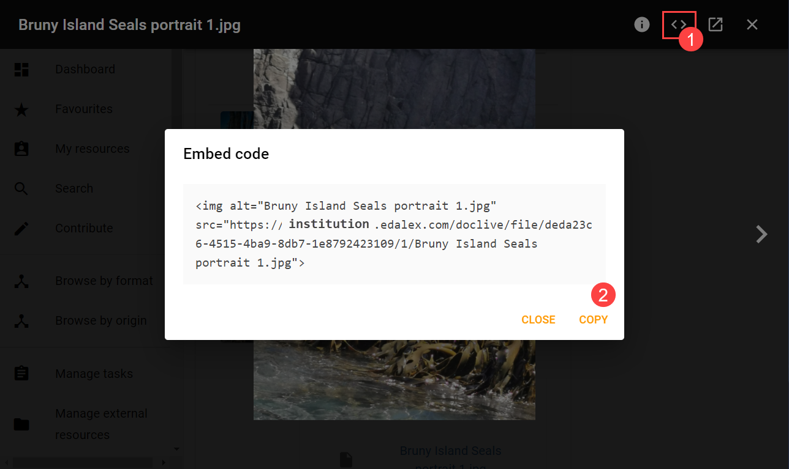
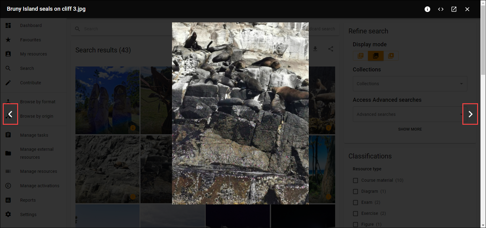
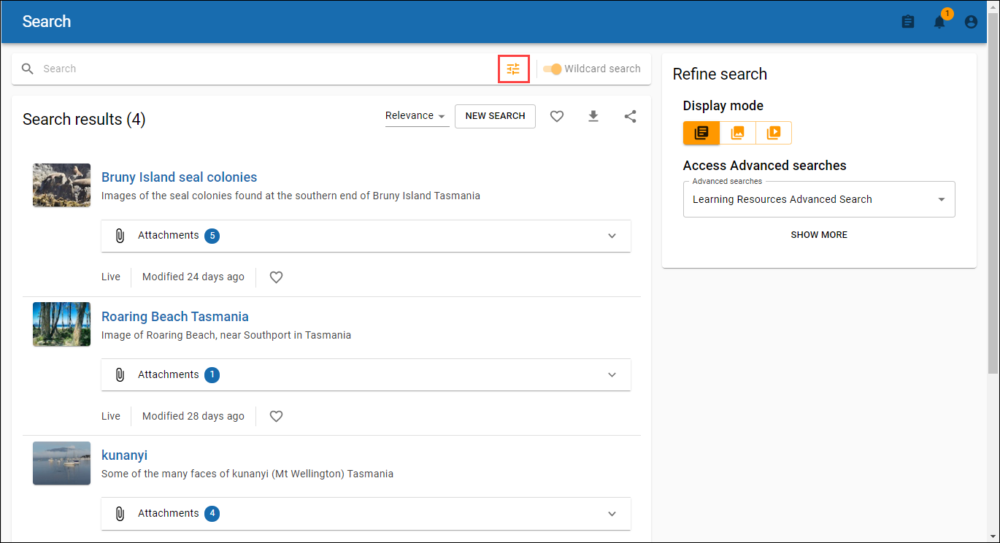

# openEQUELLA 2021.2 Features Guide

## Table of Contents
* [Search mode](#search-mode)
* [DRM enhancements](#drm-enhancements)
* [Previewing YouTube and Kaltura media](#previewing-youtube-and-kaltura-media)
* [Lightbox enhancements](lightbox-enhancements)
  * [Accessing the Resource summary page](#accessing-the-resource-summary-page)
  * [Copying embed codes](#copying-embed-codes)
* [Gallery navigation](#gallery-navigation)
* [Advanced search](#advanced-search)
  * [Advanced search wizard controls](#advanced-search-wizard-controls)
  * [Visibility scripting](#visibility-scripting)
* [Deprecation notices](#deprecation-notices)
* [Known issue](#known-issue)

# Search mode

When logging into openEQUELLA with the new Search UI switched on, the Search
page search type defaults to **Wildcard search**. In 2021.2, if the wildcard
search option is switched off by a user, their selection persists for the
endurance of their openEQUELLA session. In previous versions, it would
default back to wildcard with each new search.

Figure 1 Wildcard search on by default

Figure 2 Wildcard search option switched off persists for openEQUELLA
session

# DRM enhancements

The behaviour of attachments that belong to items with DRM Terms of use
acceptance has been enhanced so that clicking on the preview from the search
results page opens the **Terms of use** dialog. Similarly, clicking on an
image, video or audio preview belonging to a DRM item from the gallery modes
also opens the Terms of use acceptance dialog.

Figure 3 Terms of use dialog triggered from attachment preview on results
page

Figure 4 Terms of use dialog triggered from image preview from Video mode

Additionally, the message that displays when an unauthorised user attempts
to access a DRM item attachment preview has been improved. An example is
shown below.

Figure 5 DRM access violation error

# Previewing YouTube and Kaltura media

openEQUELLA 2021.2 sees the ability to preview YouTube and Kaltura video and
audio files in the new Search UI, from both the standard results page and
the video gallery.

Clicking on a YouTube or Kaltura attachment opens the file in a Lightbox and
allows media to be played. The Lightbox displays images and videos by
filling the screen, and dimming out the rest of the web page. The Lightbox
can be closed using the X in the top right.

An example is shown below.

Figure 6 YouTube video preview in Lightbox

# Lightbox enhancements

When previews are displayed in a Lightbox, users now have the ability to
access the attachment’s Resource summary page from the Lightbox.
Additionally, there is now the ability to copy the embed code for images and
media files.

## Accessing the Resource summary page

A new **Open item summary page** icon now displays in the top-right of the
Lightbox, allowing users to move to the Resource summary page for the
attachment they are currently previewing. An example is shown below.

Figure 7 Open item summary page icon

## Copying embed codes

A new Copy embed code icon is now available from the top-right of the
Lightbox, enabling users to view and copy the embed code of the current
image or media file being viewed. This embed code can be copied and pasted
into other resources to embed the content.

**NOTE: The viewer will need to meet any ACL requirements when an attachment
has been embedded in a page.**

This is a basic initial implementation of this feature, and Edalex welcomes
feedback on how this feature can be enhanced. Please send your ideas to <product@edalex.com>. 

Figure 8 Embed code copying

# Gallery navigation

openEQUELLA 2021.2 sees the extension of navigation icons to move between
attachment previews from the standard results page to include Gallery pages.

Now when selecting an image to preview from the Image mode or a media file
to preview from the Video mode, the user is provided with next and previous
arrow icons to move through the previews sequentially. Additionally,
keyboard arrows can also be used to navigate between previews. An example is
shown below.

Figure 9 Image gallery mode with next and previous preview icons

# Advanced search

Advanced searches have now been implemented in the New UI, building on the
work done for the New Search UI. This provides a new, clean look for
Advanced searches and their wizard controls.

The Advanced search criteria panel displays at the top of the page, and is
open by default when an Advanced search is selected from the Advanced search
drop-down in the Refine panel.

Figure 10 Advanced search page with Advanced search criteria panel
displaying as default

**NOTE: All results display by default when an Advanced search is opened.**

Setting advanced search criteria then clicking **SEARCH** applies the
criteria to the search results and closes the Advanced search criteria
panel.

The **Show advanced search filters** button opens and closes the Advanced
search criteria panel, and is highlighted in orange when criteria is set. An
example is shown below:

Figure 11 Show advanced search filters button displays in orange to show
criteria is set

Note that the **Refine search** panel is available to change Display modes
for results, or to further refine the search results by clicking the **SHOW
MORE** option to display standard filters, such as Date modified or Owner.

The following functions can be performed for an Advanced search:

-   **Copy search link to clipboard** – to open in another browser tab or share
    search.

-   **Add search to favourites** – to save the current search. Note that
    Advanced searches saved to Favourites in the legacy UI can be viewed in the
    new UI.

-   **Download to CSV file** – to download result data to CSV. Note that this
    can only be used for single-collection advanced searches.

### Advanced search wizard controls

All wizard controls behave in the same way as the legacy UI, but please note
the following:

#### Term selector

-   The **VIEW_TAXONOMY ACL** must be granted for users to search for taxonomy
    terms

-   openEQUELLA 2021.2 supports the **Auto-complete edit box** display – pop ups
    will be supported in a future release. If there are existing term selector
    controls that are configured to use the *Detailed Pop-up Browser* or *Wide
    Pop-up browser*, they will default to the Auto-complete edit box on the
    Advanced search page, but best practice is to change the option in the
    Advanced Search Editor accessed from the Admin Console. An example is shown
    below:

Figure 12 Advanced Search Editor -Term selector - Auto-complete Edit Box

#### User selector

-   Supports multiple-user selection, but each user must be selected one by one.

### Visibility scripting

Visibility scripting applied to wizard controls behave in the same way as
the legacy UI, but please note the following:

-   Although the Admin Console allows this, wizard controls of the same type
    within one Advanced search must not point to the same metadata schema node
    or the criteria set doesn’t function in the correct way.

-   If a control is hidden due to visibility scripting, then default values are
    (effectively) ignored.

-   Currently scripting within the New UI is limited to the API utilised by the
    **Admin Console Script Editor Basic** tab. As a result, we advise against
    using scripts which have been manually written via the **Script Editor
    Advanced** tab. Specifically, the following functions are available:

-   On the xml object: get, getAll and contains

-   On the user object: hasRole, getEmail, getFirstName, getLastName, getID and
    getUsername

# Deprecation notices

## Zookeeper

Edalex will deprecate support for Zookeeper versions earlier than 3.5.x from openEQUELLA 2022.1. It is advised that institutions on versions earlier than 3.5.x upgrade to the latest version of Zookeeper at their earliest convenience.

## Cloud search

The legacy Cloud search functionality that was introduced prior to
openEQUELLA becoming an open source product is no longer supported. The
external server providing this functionality is not controlled with any
entity directly involved in openEQUELLA and basic testing has highlighted
it’s content has not been updated for several years. As a result, support
for Cloud Search will be removed from openEQUELLA in 2022.1.

# Known issue

Edalex has identified a bug with saving openEQUELLA items for institutions
that have implemented the new UI. If the save button is clicked more than
once (e.g. double-clicked) while saving an item, attachments will be lost.
Our testing so far indicates that this bug is limited to the new UI in
versions from 2019.2 and above.

The Edalex team is working on a fix for this, and will provide a hotfix for
supported versions, most likely in January 2022.

**NOTE: It is standard for web application buttons to begin their action as
soon as a single click occurs. Double clicking on buttons in web
applications such as openEQUELLA is not recommended.**
