# Attachment counts

>   openEQUELLA 2021.1 sees the introduction of attachment counts on the new
>   Search UI page. This enables users to easily see how many attachments are
>   available for an item without having to open the attachment list. The count
>   includes all attachment types, including files and links. Items with no
>   attachments show no count icon.

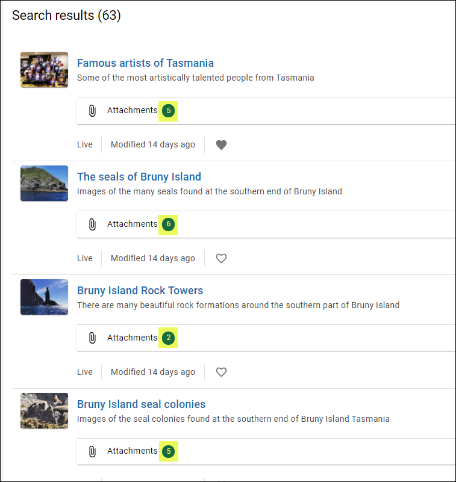

>   Figure 1 New Search UI page - attachment counts

# Attachment previewing – Next and Previous

>   The new UI Search page now supports the previewing of multiple images and
>   videos for an item from the results panel using Lightbox technology which
>   includes being able to move through previews using Next and Previous arrows.
>   Lightbox is a JavaScript library that displays images and videos by filling
>   the screen, and dimming out the rest of the web page. An example is shown
>   below.

>   Figure 2 Image and video previewing with Next and Previous arrows

>   The file name displays in the top left of the box, and **Open in new tab**
>   and **Close** buttons display in the top right.

>   Figure 3 Open in new tab button

>   When an image is opened in a new tab, the cursor displays as a magnifying
>   glass with a plus sign, allowing the user to click on an area of the image
>   to zoom in. Scroll bars display to navigate the zoomed in image, and the
>   magnifying glass cursor displays a minus sign. Clicking again zooms the
>   image back out. An example is shown below.

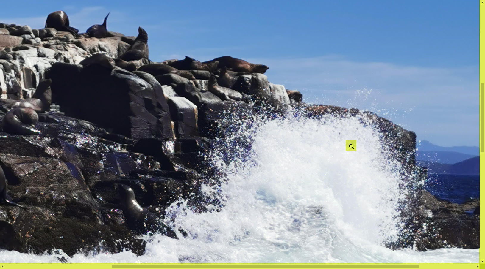

>   Figure 4 Image displaying in new tab and zoomed in

# Favourite items and searches 

>   The ability to add and remove favourite items from the search results page
>   and saving favourite searches has been added to the new search UI page in
>   2021.1.

## Adding and removing items from Favourites

>   Items can be added to or removed from a user’s favourite items list
>   (accessed from the Favourites menu item) by clicking the heart icon
>   displayed for each item in the search results panel. An outlined heart can
>   be clicked to add the item to Favourites, and a solid heart indicates that
>   the item is a current favourite. Click on a solid heart to remove from
>   Favourites.

>   Figure 5 Search results - Favourites icons

####  To add an item to Favourites

1.  From the Search results panel, click the heart icon for the item to be added
    to Favourites. The **Add to favourites** dialog displays.

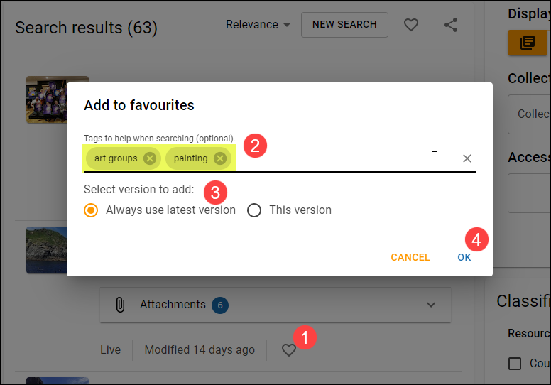

>   Figure 6 Add to favourites dialog

1.  Enter any relevant **Tags**, using Enter to separate. Single tags can be
    deleted using the **X** beside that tag or all tags can be removed using the
    **X** to the right of all tags.

2.  Select the required Version option.

3.  **Always use latest version** – will always link to the latest version
    available from Favourites

4.  **This version** – will always link to this specific version of the item
    from Favourites.

5.  Click **OK**. The item is added to Favourites and the icon displays as a
    solid heart. Click on the solid heart to remove an item from Favourites.

## Saving searches to Favourites

>   openEQUELLA 2021.1 supports saving searches to Favourites in the new Search
>   UI. This includes saving any criteria set with the search, including key
>   words, search mode and any filters.

#### To save a search to Favourites

1.  Enter the required search criteria, including key words and filters then
    click the heart icon in the top right of the search results panel. The **Add
    search to favourites** dialog displays.

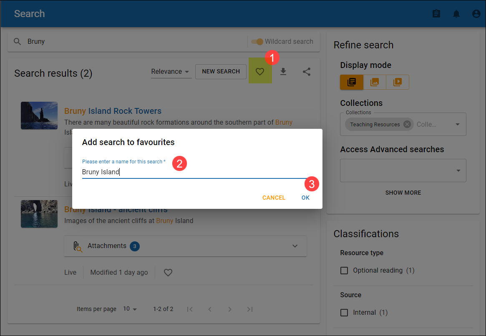

>   Figure 7 Add search to favourites dialog

1.  Enter a name for the search. This is the name that displays on the
    Favourites, Searches page.

2.  Click **OK**. The search is saved to the Favourite searches page with all
    search criteria.

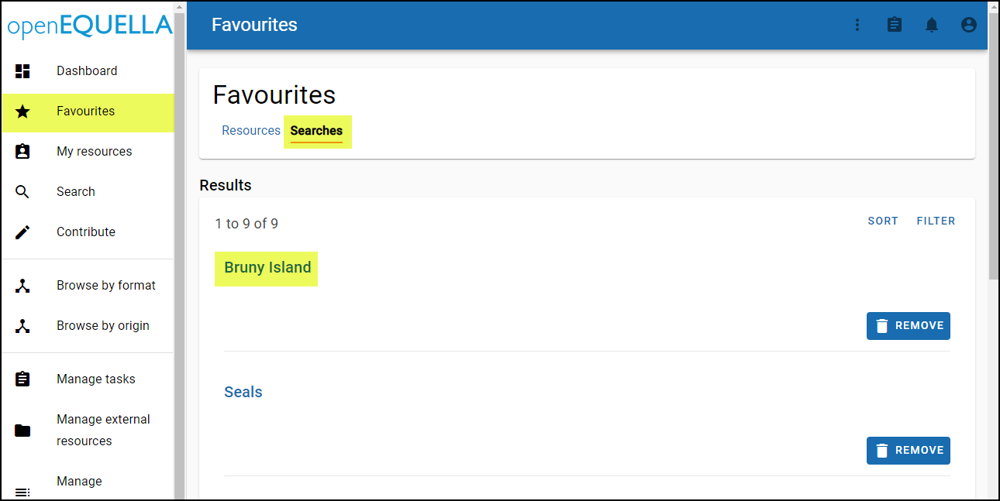

>   Figure 8 Favourites - Searches page

# MIME type filters

>   The openEQUELLA 2021.1 new search UI page now supports MIME type filters.
>   MIME type filters are configured from **Settings**, **Search**, **Search
>   filters.**

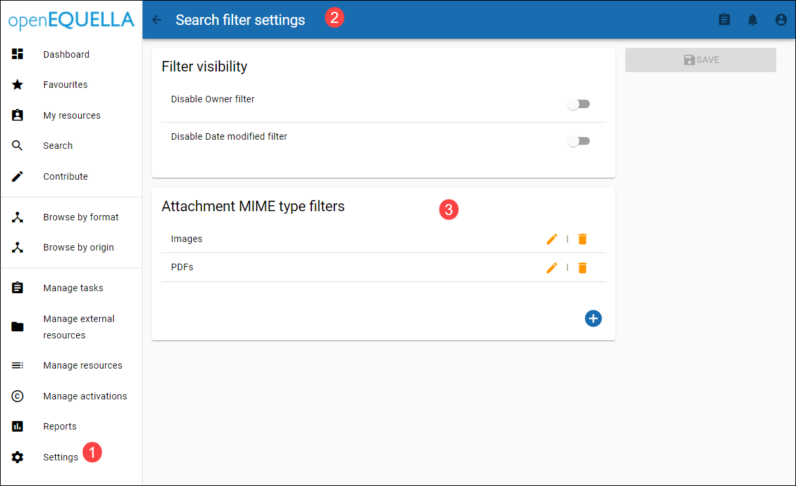

>   Figure 9 Settings, Search filters page

>   Attachment MIME type filters are accessed by selecting the **Show more**
>   option in the Refine search panel on the new search UI page. Any configured
>   filters display in the **Filter by Attachment type** drop-down. One or
>   multiple values can be selected.

>   Figure 10 Search page - Filter by Attachment type filter

# Gallery modes

>   openEQUELLA 2021.1 introduces new Image and Video gallery modes to the new
>   search UI page, using Lightbox technology. Lightbox is a JavaScript library
>   that displays images and videos by filling the screen, and dimming out the
>   rest of the web page.

>   Search terms, filters and classifications can be used from gallery views and
>   the results returned are the images or videos attached to the items matching
>   the search criteria.

>   The viewing modes (Standard, Image and Video) are selected from the
>   **Display mode** control at the top of the Refine search panel.

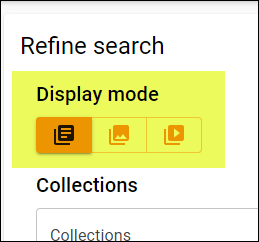

>   Figure 11 Display mode control

## Image mode

>   The new Image mode displays all image attachments for items in openEQUELLA
>   (as opposed to the legacy UI, which displays only the first image attachment
>   for each item).

>   Select the **Image** option from **Display mode** to display all images in
>   the gallery view.

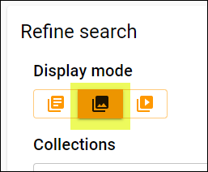

>   Figure 12 Display mode - Image

An example is shown below.

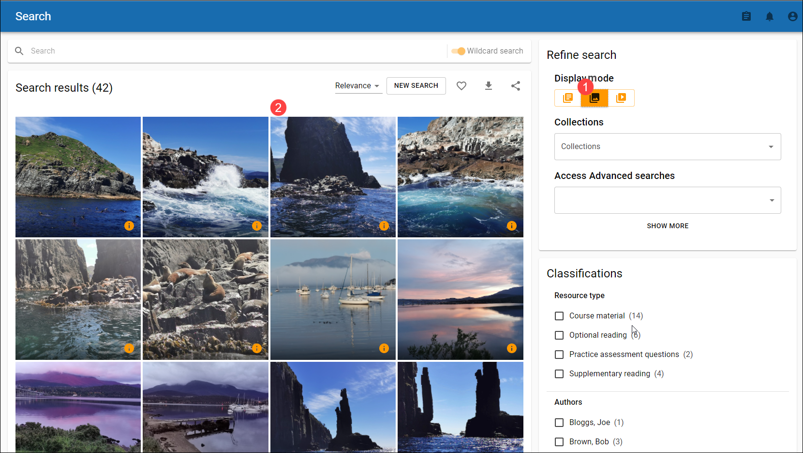

>   Figure 13 Search results in image mode

>   Clicking the **View item** button opens the Resource summary page.

>   Figure 14 View item button

>   Clicking anywhere on the image opens the image in a lightbox. An example is
>   shown below.

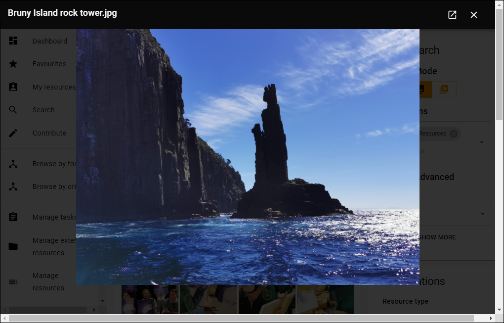

>   Figure 15 Image preview in lightbox

>   Clicking away from the image window closes the lightbox.

>   The file name displays at the top left of the box, and **Open in new tab**
>   and **Close** buttons display in the top right.

>   Figure 16 Open in new tab button

>   When an image is opened in a new tab, the cursor displays as a magnifying
>   glass with a plus sign, allowing the user to click on an area of the image
>   to zoom in. Scroll bars display to navigate the zoomed in image, and the
>   magnifying glass cursor displays a minus sign. Clicking again zooms the
>   image back out. An example is shown below.

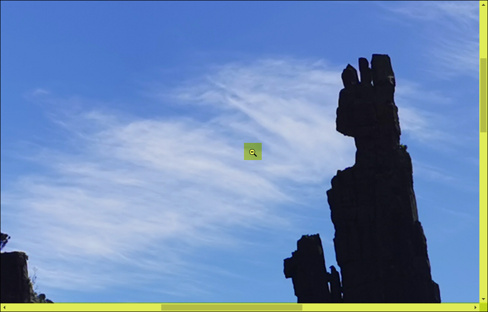

>   Figure 17 Image displaying in new tab and zoomed in

## Video gallery

>   The new Video mode displays all video attachments for items in openEQUELLA
>   (as opposed to the legacy UI, which displays only the first video attachment
>   for each item).

>   Select the **Video** option from **Display mode** to display all videos in
>   the gallery view.

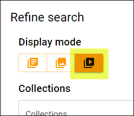

>   Figure 18 Display mode - Video

>   An example is shown below.

>   Figure 19 Search results in video mode

>   Clicking the **View item** button opens the Resource summary page.

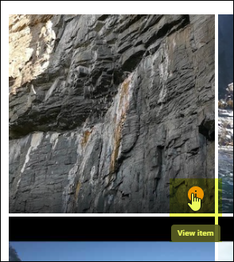

>   Figure 20 View item button

### Local videos

>   Clicking on a locally stored video opens the video in a lightbox. An example
>   is shown below.

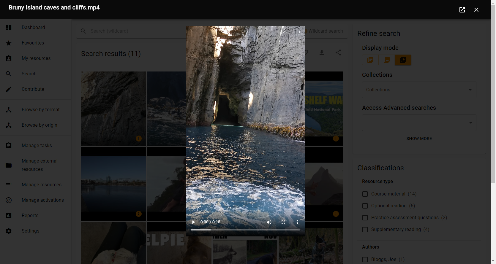

>   Figure 21 Video preview in lightbox

>   Clicking away from the video window closes the lightbox.

>   The file name displays at the top left of the box, and **Open in new tab**
>   and **Close** buttons display in the top right.

>   Figure 22 Open in new tab button

>   A number of controls display at the bottom of the video window, as shown
>   below.

>   Figure 23 Video controls

>   Controls include:

-   Play (and Pause) button – click to play or pause video.

-   Time – Current time in video and total video time.

-   Volume – click to change volume or mute.

-   Full screen – click to change to full screen mode.

-   Options – the options menu includes:

-   Download – downloads the video to a local drive

-   Picture-in-picture – select to open a video window which persists across
    your computer. This allows for the watching of videos while looking at other
    things, for example, instructional videos on how to carry out a
    configuration task in the operating system etc. Once selected, this option
    becomes Exit from picture-in-picture. The picture-in-picture video window
    can be closed at any time. An example with picture-in-picture mode enabled
    is shown below.

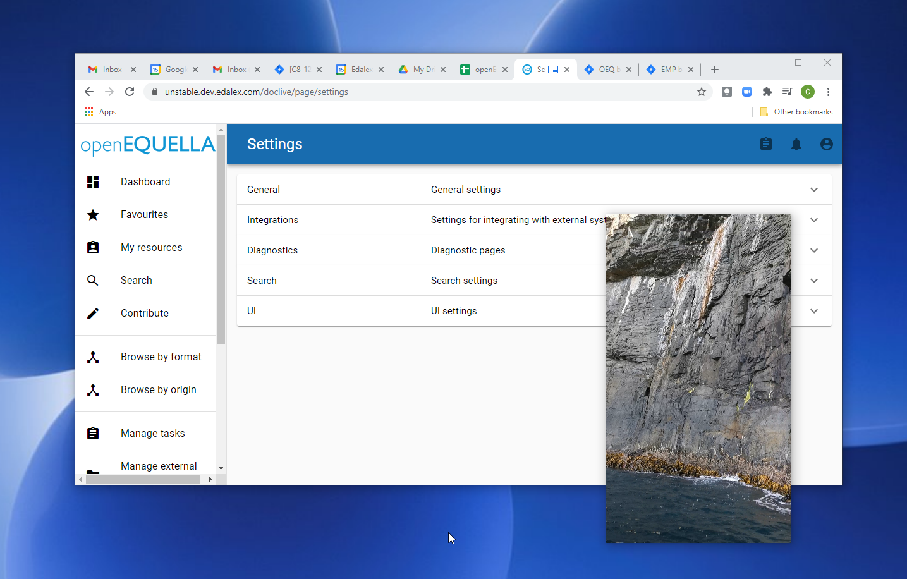

>   Figure 24 Video mode - picture-in-picture

### YouTube video links

>   Clicking on a YouTube video opens the YouTube video in a lightbox. An
>   example is shown below.

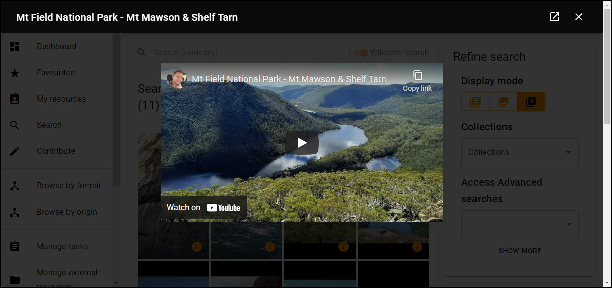

>   Figure 25 YouTube video in lightbox

>   Clicking away from the video window closes the lightbox.

>   The file name displays at the top left of the box, and **Open in new tab**
>   and **Close** buttons display in the top right.

>   Figure 26 Open in new tab button

>   Clicking **Open in new tab** opens the YouTube page for the video.

>   Controls include:

-   Copy link – click to copy the YouTube video link.

-   Play (and Pause) button – click to play or pause video.

-   Watch on YouTube – click to open video in YouTube.

    Once the video is playing, more controls display. An example is shown below.

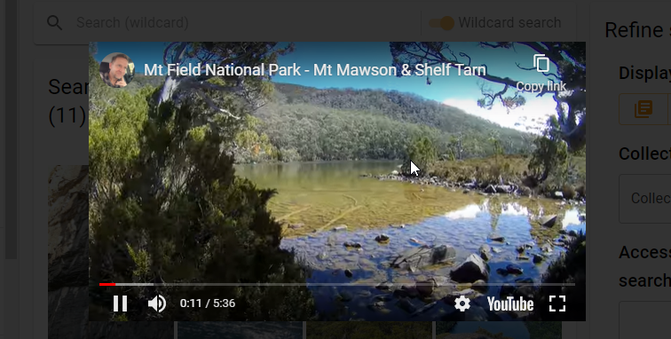

>   Figure 27 YouTube video (playing)

>   Controls include:

-   Play (and Pause) button – click to play or pause video.

-   Volume – click to change volume or mute.

-   Time – current time in video and total video time.

-   Settings – click to set Playback speed and Quality options.

-   YouTube – click to open video in YouTube.

-   Full screen – click to change to full screen mode.

When a video is paused, a **More videos** feature displays in the video window,
showing videos related to the current video topic. Click on a video to open it
in YouTube.

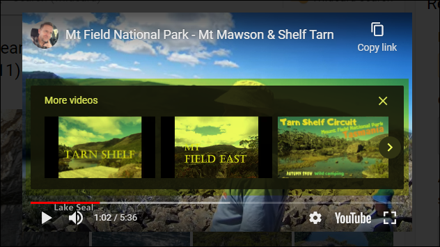

>   Figure 28 Paused video - More videos feature

# Download Search results to CSV

>   A new feature has been introduced in the new Search UI for openEQUELLA
>   2021.1 enabling suitably privileged users to download search results to a
>   CSV file.

>   All data stored in the item XML is included in the download, and multiple
>   values are separated using a double pipe (\|\|).

## EXPORT_SEARCH_RESULTS ACL

>   A new ACL, EXPORT_SEARCH_RESULTS is available to control access to the
>   Download to CSV file function. It is available from the Collection level in
>   the Security Manager accessed in the Administration Console. Access can be
>   granted at the top Collection level allowing users to download results from
>   every collection, or at a specific collection level to grant access only to
>   the selected collection.

>   NOTE: The Download to CSV button displays for all users, but will only work
>   for suitably privileged users.

## Downloading result to CSV

>   A new **Download to CSV** button displays at the top of the Results panel on
>   the new Search UI page.

>   NOTE: Downloading to CSV is limited to ONE collection. One collection must
>   be selected in the Collection filter to use this function.

#### To download search result to a CSV file

1.  Select a Collection from the **Collections** filter.

2.  Complete the search query, including using keywords and/or filters.

3.  Click the **Download to CSV** button.

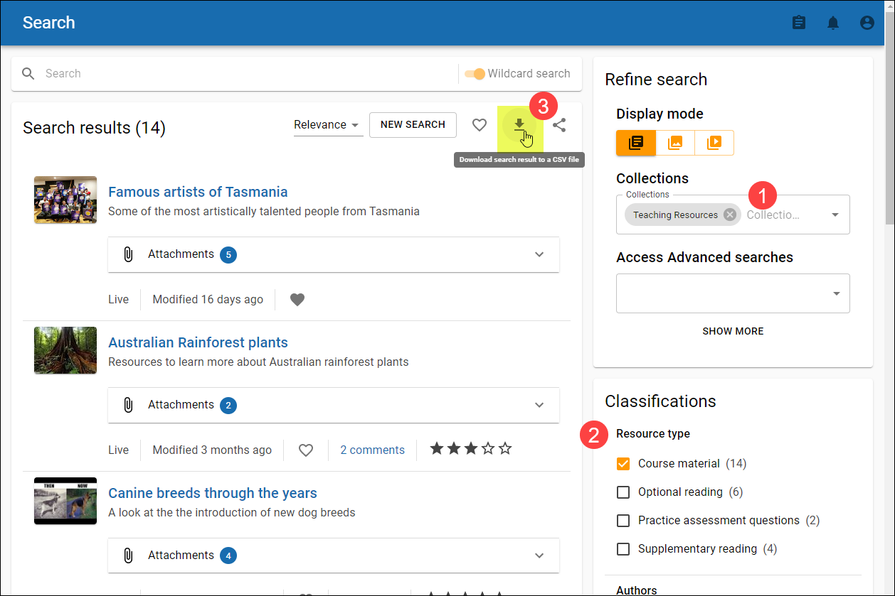

>   Figure 29 Download search results to CSV file

>   The CSV file is downloaded to your local hard drive, and the Download to CSV
>   button displays as an orange tick until the search query has been changed.
>   This prevents the same search results being downloaded multiple times while
>   the initial file is being downloaded.

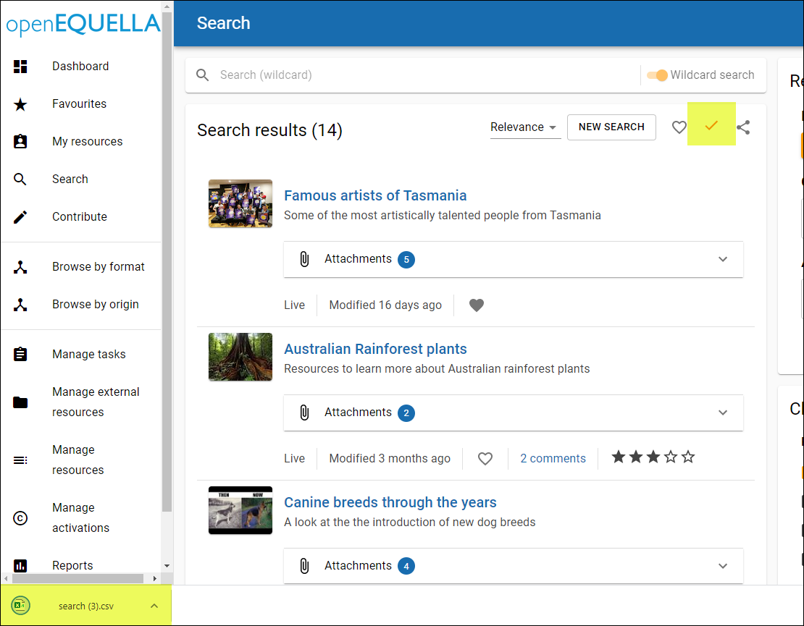

>   Figure 30 CSV file download
